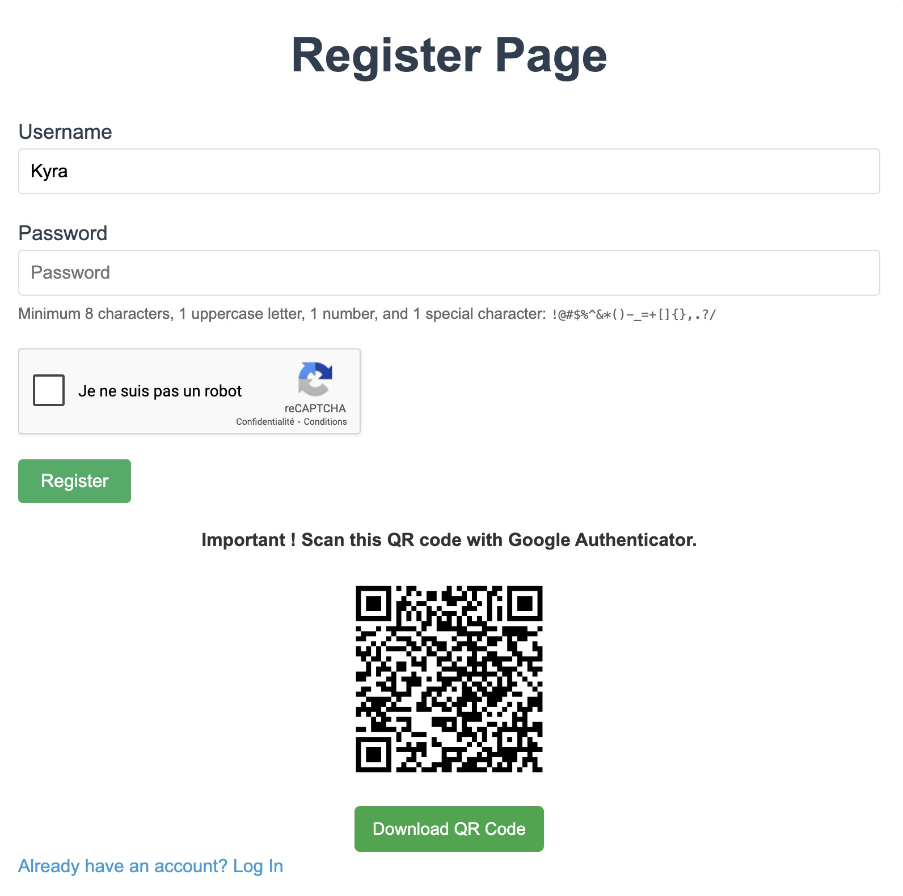

# SeciProject – Secure File Sharing Platform (NAS)

[](https://www.python.org/)
[](https://flask.palletsprojects.com/)
[](https://www.sqlite.org/)
[](#-security)
[](#-license)

A **privacy‑aware, educational web app** built with **Flask** for secure file storage and sharing.  
It features **user accounts**, **Two‑Factor Authentication (2FA)**, **per‑folder sharing**, **audit logs**, and **rate‑limiting**—backed by an **embedded SQLite** database.

---

## Features

- **Authentication & 2FA**: email+password + TOTP (Google Authenticator compatible).
- **Secure password hashing**: **Argon2** with environment‑driven parameters.
- **Role‑aware dashboard**: personal space, **shared by me**, **shared with me**.
- **Per‑user storage** under `uploads/<username>` with isolation.
- **Folder management**: create, list, browse, and share directories.
- **File upload & listing** with size/type checks.
- **Audit logs**: views, uploads, sharing actions.
- **Rate limiting** (429 page) to mitigate brute force/abuse.
- **HTTPS‑ready** (local certs under `private/`).

---

## Project Structure

```
SeciProject/
├─ app.py
├─ requirements.txt
├─ start.sh
├─ instance/
│  └─ database.db            # SQLite DB (runtime)
├─ templates/                # Flask Jinja templates
│  ├─ home.html              # Landing
│  ├─ login.html             # Login
│  ├─ register.html          # Registration
│  ├─ 2fa.html               # Two‑Factor setup/verify
│  ├─ dashboard.html         # User dashboard
│  ├─ view_directory.html    # Browse files/folders
│  ├─ shared_by_me.html
│  ├─ shared_with_me.html
│  ├─ users.html             # Admin/user list (if applicable)
│  ├─ logs.html              # Audit logs
│  └─ 429.html               # Rate limit
├─ static/
│  ├─ css/styles.css
│  └─ js/scripts.js
├─ uploads/                  # User storage root
├─ private/
│  ├─ localhost.pem
│  └─ localhost-key.pem
├─ docs/
│  └─ images/                # Screenshots for documentation/README
│     ├─ Home.jpeg
│     ├─ LoginPageUncomplete.jpeg
│     ├─ Register.jpeg
│     ├─ RegisterAuthentificator.jpeg
│     ├─ Two-Factor.jpeg
│     ├─ Contacts.jpeg
│     ├─ SharedFolders.jpeg
│     ├─ UploadAFile.jpeg
│     ├─ NewDirectory.jpeg
│     ├─ ListFile.jpeg
│     └─ Logs.jpeg
└─ .env.example              # Sample environment variables
```

---

## ⚙️ Setup

### 1) Clone & environment
```bash
git clone <your-repo-url>.git
cd SeciProject
python -m venv .venv
source .venv/bin/activate           # Windows: .venv\Scripts\activate
pip install -r requirements.txt
cp .env.example .env                # then edit values
```

### 2) Initialize database
The app uses **SQLite** (file at `instance/database.db`). On first run, tables are created automatically.

### 3) Run (development)
```bash
flask --app app run --debug
# or: bash start.sh
```

> For HTTPS locally, point Flask to the certs in `private/` or configure a reverse proxy (Traefik/Nginx).

---

## Getting Started

Once the server is running:

1. Open your browser at **[https://localhost:5000](https://localhost:5000)**.  
2. Go to **Register** and create your first account.  
3. On first login, set up **Two‑Factor Authentication (2FA)** by scanning the QR code with Google Authenticator (or Authy).  
4. Enter the 6‑digit code to activate your account.  
5. You’ll be redirected to your **Dashboard**, where you can:  
   - Create new folders  
   - Upload files  
   - Share directories with other users  
   - View your activity in **Logs**  

---

## Configuration

Environment variables (from `.env`), examples:

```
SECRET_KEY=change-me
SECURITY_PASSWORD_SALT=change-me-too

# Argon2 parameters (security vs. performance)
ARGON_MEMORY_COST=65536
ARGON_TIME_COST=3
ARGON_PARALLELISM=4

# Uploads
MAX_CONTENT_LENGTH=104857600        # 100MB
ALLOWED_EXTENSIONS=pdf,jpg,jpeg,png,txt,zip
```

> Never commit your real `.env`. Use `.env.example` as a template.

---

## SSL Certificates

This project includes a pair of **self‑signed certificates** for development under `private/`:

```
private/
 ├─ localhost.pem        # Certificate
 └─ localhost-key.pem    # Private key
```

- They allow you to run the app in **HTTPS** mode locally (`https://localhost:5000`).  
- Browsers will warn that the certificate is not trusted — this is expected in development.  
- For production, replace these with certificates from a trusted CA (e.g., **Let’s Encrypt**) and serve Flask behind a reverse proxy (Nginx/Traefik).  

---

## Usage

- **Register → Login → 2FA setup** (scan QR on `2fa.html`).  
- Manage your space from **Dashboard**: create folders, upload files.  
- Share a folder with another user (read‑only or write, depending on your logic).  
- Check **Logs** to audit actions.

---

## UI Preview

<p align="center">
  
  
</p>

<p align="center">
  
  
</p>

<p align="center">
  
  
</p>

<p align="center">
  
  
</p>

<p align="center">
  
  
</p>

---

## Security

- **Argon2** password hashing with **configurable cost** from `.env`.
- **TOTP 2FA** (compatible with Google/Authy).
- **Per‑user storage isolation** under `uploads/<username>`.
- **Rate limiting** to protect login/critical endpoints (HTTP 429 page included).
- **Content‑type & size checks** on uploads.
- **HTTPS‑ready**: local certs provided for development.
- **Audit logging** of sensitive actions.

> Consider adding a reverse proxy (Nginx) and proper headers (CSP, HSTS) for production.

---

## Roadmap

- Granular permissions (read/write/share links with expiry).  
- Virus scanning hook on upload (e.g., ClamAV).  
- Object storage backend (S3/MinIO) for large files.  
- Admin panel (RBAC) and invitation system.  
- Email notifications and password reset flow.

---

## Contributing

1. Fork the repo  
2. Create a feature branch: `git checkout -b feature/xyz`  
3. Commit your changes and open a PR  
4. Describe your context and test steps

---

## License

This project is licensed under the MIT License.  
You are free to use, copy, modify, merge, publish, distribute, sublicense, and/or sell copies of the software, 
provided that the original copyright notice and this permission notice are included in all copies.  

See the [LICENSE](LICENSE) file for the full text.

---

## Author

**Alec Waumans** — Industrial Computer Science (Embedded & Security).
